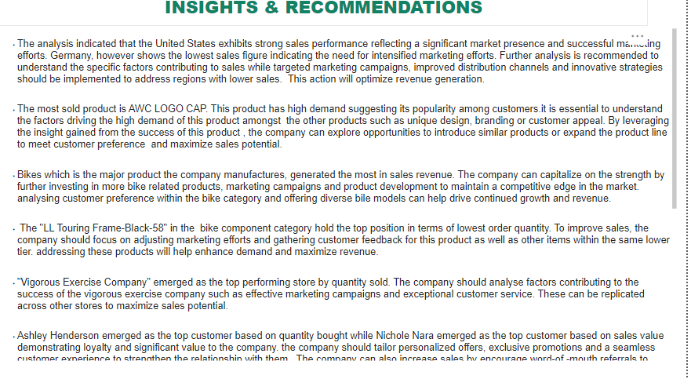

# Consumer-Preference-Analysis

---
## Introduction
This is a PowerBI project on consumer analysis of a fictitious company called **SellCheapy Stores** that specialises in Bikes and different components.The project aim is to analyze and derive insights to understand customer spending in other to increase sales and drive business growth.

## Problem Statement
SellCheapy Stores has been struggling with sales despite having a large customer base, the company want to perform a data analysis to understand their customer spending pattern in other to know where to focus their marketing strategies.The goal of this analysis is to answer these business questions:
1. Which products are generating the highest sales revenue and number of orders?
2. Which products are generating the lowest sales revenue and number of orders
3. What are the popular products within each product category? 
4. Who are our loyal and most frequent customers?
5. Which store is generating the highest and lowest sales revenue and number of orders?
6. What is the current market demand for the products in the regions the company operates in order to identify areas that need improvement?

## Skills/Concept Demonstrated
- Utilized SQL to query the database using statements such as SELECT, JOIN, CASE WHEN, and created views.
- Connected the queried data to Power BI for analysis and visualization.
- Created a date table to support time-based analysis and calculations.
- Implemented measures using DAX functions in Power BI, including SUM, FILTER, TOPN, and CALCULATE, to calculate metrics like top customers and top stores.
- Created new columns to derive additional insights and perform custom calculations.
- Conducted data modeling to optimize the structure and relationships between tables.
- Applied critical thinking skills to analyze data,and draw meaningful conclusions for decision-making.

## Data Transformation
- I wrote several queries to retrieve the data from the database and i saved these queries as view to enable easy access and reuse of the queries

A                            |B
:--------------------------:|:------------------------:
     |   
---

- I imported the view to PowerBI for data visualization

---

- I transformed the data in Powerquery and created a date table

## Modelling
*The model is a star schema.*
*There are 2 fact table and 5 dimension tables*

---
The automacticaly derived relationship done by PowerBI was adjusted to remove and replace unwanted relationships. I carefully reviewed and modified the relationships between tables to ensure their accuracy and relevance to the data then i created a well-defined data model by establishing one-to-many relationships.

## Data Analysis
Created several measures to help with my analysis such as 

   1. Top Customer (Sales Value) = 
          CALCULATE(
              FIRSTNONBLANK(TOPN(1,VALUES(PERSONSDIMTABLE[Name]),[SumSale] ), 1 ),
                 FILTER(PERSONSDIMTABLE,PERSONSDIMTABLE[PersonType] = "IN" &&COUNTROWS(
                     FILTER(PERSONSDIMTABLE,PERSONSDIMTABLE[Name] = EARLIER(PERSONSDIMTABLE[Name])) ) = 1
            
 
   2. Top Customer(qty bought) = 
          CALCULATE( 
               FIRSTNONBLANK(TOPN(1,VALUES(PERSONSDIMTABLE[Name]), [QtySold]),1),
                  FILTER(PERSONSDIMTABLE,PERSONSDIMTABLE[PersonType]="IN"&&COUNTROWS(
                    FILTER(PERSONSDIMTABLE,PERSONSDIMTABLE[Name] = EARLIER(PERSONSDIMTABLE[Name])) ) = 1
            
 
    3. Best Selling Product = 
           FIRSTNONBLANK(TOPN(1, VALUES(PRODUCTTABLE[ProductName]), [QtySold]), 1)
 
 
 
 ## Data Visualization
 Created a 4 page report that includes 
 1. Sales Overview
 2. Product Overview
 3. Consumer Overview
 4. Insights/Recommendation

**Here are the screenshot of the report and it can be interacted with on PowerBI [here](https://app.powerbi.com/view?r=eyJrIjoiMDFjMWQ4OGYtMDI5YS00NjA3LWI0ZDMtMmU0OWJhZDFmOGFhIiwidCI6IjQ1YWMwYzZhLWQ0NzUtNDcxNS1hMmFhLTMwMDk2OGM1Y2U4MCIsImMiOjl9)

#### SALES 

#### CONSUMER 

#### PRODUCT 

#### INSIGHTS/RECOMMENDATIONS

