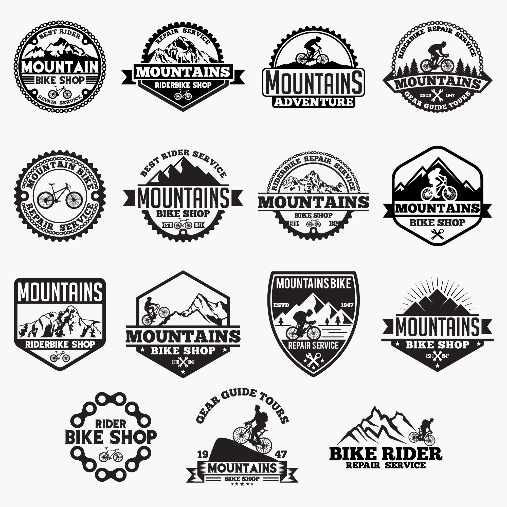
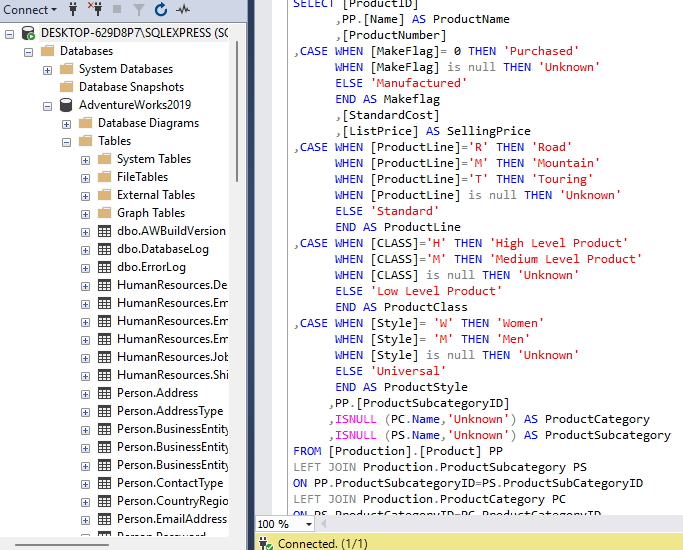
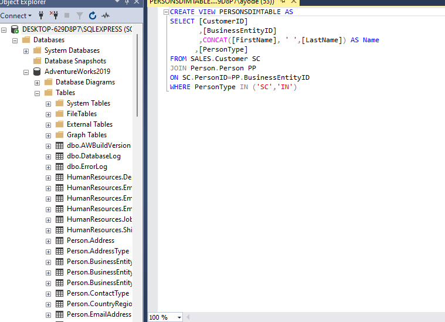
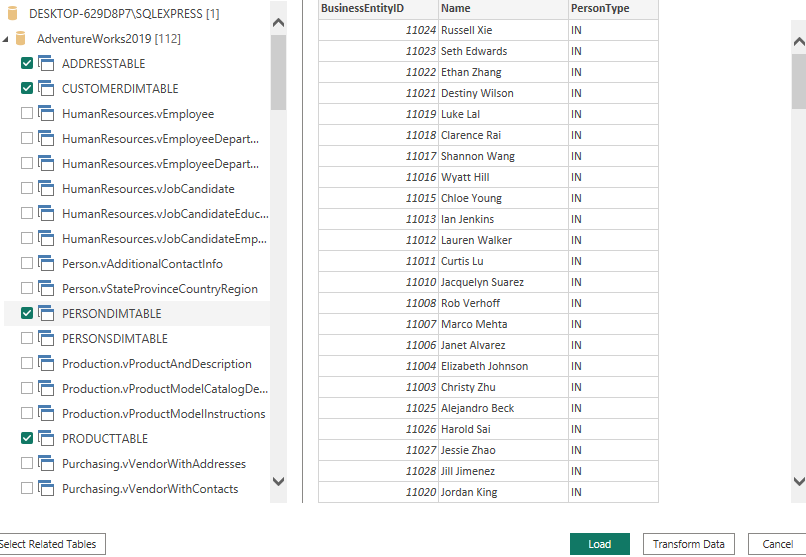
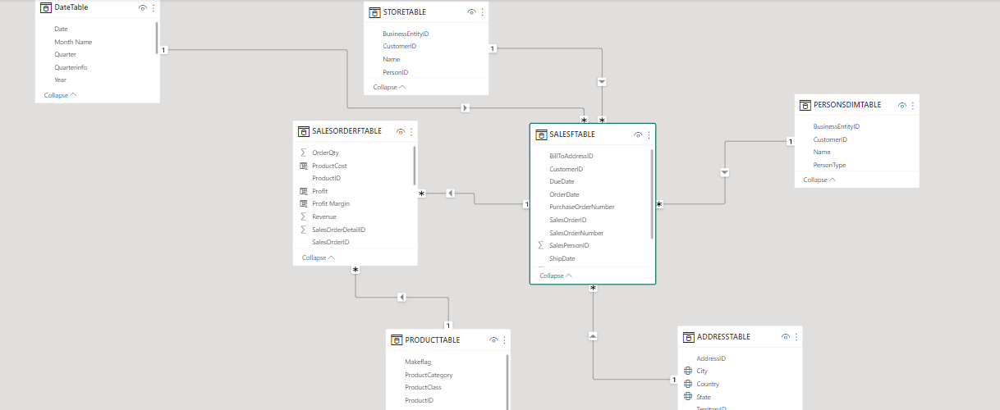
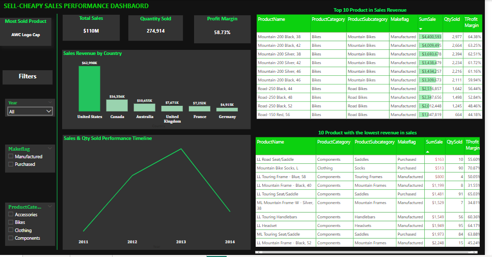
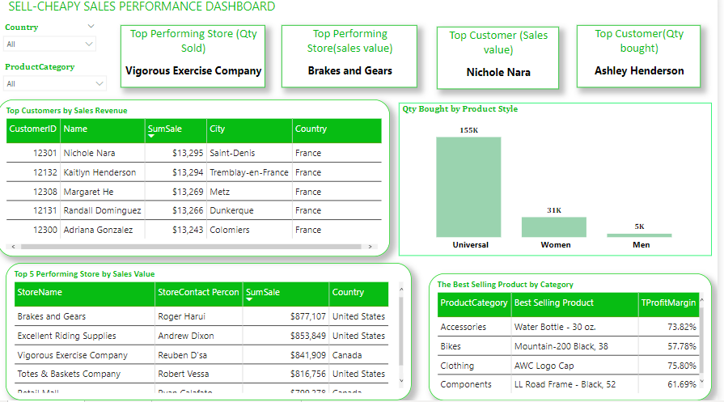
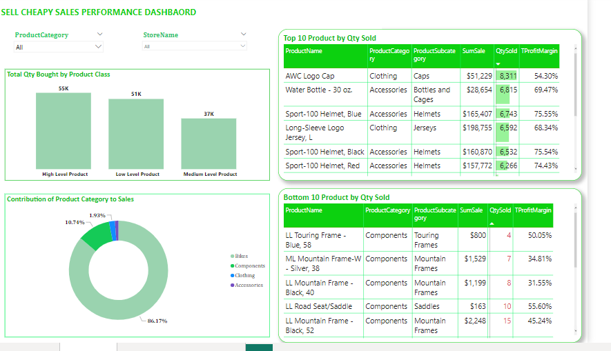

# Consumer-Preference-Analysis

---
## Introduction
This is a PowerBI project on consumer analysis of a fictitious company called **SellCheapy Stores** that specialises in Bikes and different components.The project aim is to analyze and derive insights to understand customer spending in other to increase sales and drive business growth.

## Problem Statement
SellCheapy Stores has been struggling with sales despite having a large customer base, the company want to perform a data analysis to understand their customer spending pattern in other to know where to focus their marketing strategies.The goal of this analysis is to answer these business questions:
1. Which products are generating the highest sales revenue and number of orders?
2. Which products are generating the lowest sales revenue and number of orders
3. What are the popular products within each product category? 
4. Who are our loyal and most frequent customers?
5. Which store is generating the highest and lowest sales revenue and number of orders?
6. What is the current market demand for the products in the regions the company operates in order to identify areas that need improvement?

## Skills/Concept Demonstrated
- Utilized SQL to query the database using statements such as SELECT, JOIN, CASE WHEN, and created views.
- Connected the queried data to Power BI for analysis and visualization.
- Created a date table to support time-based analysis and calculations.
- Implemented measures using DAX functions in Power BI, including SUM, FILTER, TOPN, and CALCULATE, to calculate metrics like top customers and top stores.
- Created new columns to derive additional insights and perform custom calculations.
- Conducted data modeling to optimize the structure and relationships between tables.
- Applied critical thinking skills to analyze data,and draw meaningful conclusions for decision-making.

## Data Transformation
- I wrote several queries to retrieve the data from the database and i saved these queries as view to enable easy access and reuse of the queries

A                            |B
:--------------------------:|:------------------------:
     |   
---

- I imported the view to PowerBI for data visualization

---

- I transformed the data in Powerquery and created a date table

## Modelling
*The model is a star schema.*
*There are 2 fact table and 5 dimension tables*

---
The automacticaly derived relationship done by PowerBI was adjusted to remove and replace unwanted relationships. I carefully reviewed and modified the relationships between tables to ensure their accuracy and relevance to the data then i created a well-defined data model by establishing one-to-many relationships.

## Data Analysis
Created several measures to help with my analysis such as 

   1. Top Customer (Sales Value) = 
          CALCULATE(
              FIRSTNONBLANK(TOPN(1,VALUES(PERSONSDIMTABLE[Name]),[SumSale] ), 1 ),
                 FILTER(PERSONSDIMTABLE,PERSONSDIMTABLE[PersonType] = "IN" &&COUNTROWS(
                     FILTER(PERSONSDIMTABLE,PERSONSDIMTABLE[Name] = EARLIER(PERSONSDIMTABLE[Name])) ) = 1
            
 
   2. Top Customer(qty bought) = 
          CALCULATE( 
               FIRSTNONBLANK(TOPN(1,VALUES(PERSONSDIMTABLE[Name]), [QtySold]),1),
                  FILTER(PERSONSDIMTABLE,PERSONSDIMTABLE[PersonType]="IN"&&COUNTROWS(
                    FILTER(PERSONSDIMTABLE,PERSONSDIMTABLE[Name] = EARLIER(PERSONSDIMTABLE[Name])) ) = 1
            
 
    3. Best Selling Product = 
           FIRSTNONBLANK(TOPN(1, VALUES(PRODUCTTABLE[ProductName]), [QtySold]), 1)
 
 
 
 ## Data Visualization
 Created a 4 page report that includes 
 1. Sales Overview
 2. Product Overview
 3. Consumer Overview
 4. Insights/Recommendation

**Here are the screenshot of the report and it can be interacted with on PowerBI [here](https://app.powerbi.com/view?r=eyJrIjoiMDFjMWQ4OGYtMDI5YS00NjA3LWI0ZDMtMmU0OWJhZDFmOGFhIiwidCI6IjQ1YWMwYzZhLWQ0NzUtNDcxNS1hMmFhLTMwMDk2OGM1Y2U4MCIsImMiOjl9)

#### SALES 

#### CONSUMER 

#### PRODUCT 

#### INSIGHTS/RECOMMENDATIONS

## Insights/Recommendation

- The analysis indicated that the United States exhibits strong sales performance reflecting a significant market presence and successful marketing efforts. Germany, however shows the lowest sales figure indicating the need for intensified marketing efforts. Further analysis is recommended to understand the specific factors contributing to sales while targeted marketing campaigns, improved distribution channels and innovative strategies should be implemented to address regions with lower sales.  This action will optimize revenue generation.

- The most sold product is AWC LOGO CAP. This product has high demand suggesting its popularity among customers.it is essential to understand the factors driving the high demand of this product amongst  the other products such as unique design, branding or customer appeal. By leveraging the insight gained from the success of this product , the company can explore opportunities to introduce similar products or expand the product line to meet customer preference  and maximize sales potential.

- Bikes which is the major product the company manufactures, generated the most in sales revenue. The company can capitalize on the strength by further investing in more bike related products, marketing campaigns and product development to maintain a competitive edge in the market. analysing customer preference within the bike category and offering diverse bile models can help drive continued growth and revenue.

 - The "LL Touring Frame-Black-58" in the  bike component category hold the top position in terms of lowest order quantity. To improve sales, the company should focus on adjusting marketing efforts and gathering customer feedback for this product as well as other items within the same lower tier. addressing these products will help enhance demand and maximize revenue.

- "Vigorous Exercise Company" emerged as the top performing store by quantity sold. The company should analyse factors contributing to the success of the vigorous exercise company such as effective marketing campaigns and exceptional customer service. These can be replicated across other stores to maximize sales potential.

- Ashley Henderson emerged as the top customer based on quantity bought while Nichole Nara emerged as the top customer based on sales value demonstrating loyalty and significant value to the company. the company should tailor personalized offers, exclusive promotions and a seamless customer experience to strengthen the relationship with them . The company can also increase sales by encourage word-of -mouth referrals to attract new customers.

- The sales performance in 2014 experienced a reduction compared to the previous year, 2013. However, there is a potential for improvements in the remaining quarters of 2014, particularly by focusing efforts on products with low sales. the company will need to monitor sales progress throughout the remaining quarters of 2014 and make necessary adjustments to maximize sales potentials.
